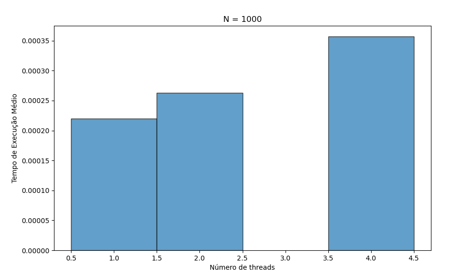
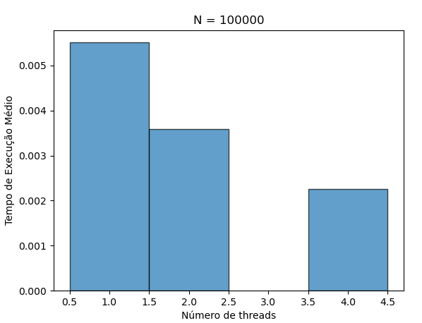
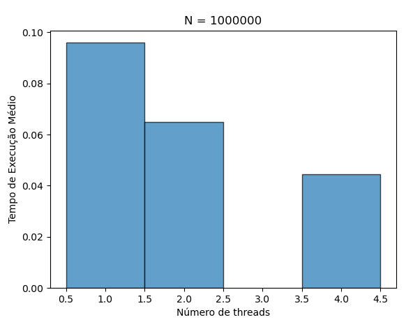

# Resultados

Para N = 1000, não teve uma melhora na performance com o aumento do número de threads, na verdade houve um aumento no tempo de execução. Possivelmente por N ser pequeno, a solução concorrente foi mais custosa que a sequencial.

A partir de 100.000, vemos uma redução significativa no tempo de execução.

## Calculando a aceleração e eficiência

Para N = 1000:
| Threads | Tempo médio (s) |        Aceleração      | Eficiência (%) |
|---------|-----------------|------------------------|----------------|
| 1       | 0.000220        | 1.00×                  | 100.00%        |
| 2       | 0.000263        | 0.83×                  | 41.50%         |
| 4       | 0.000357        | 0.61×                  | 15.25%         |

Para N = 100.000:

| Threads | Tempo médio (s) |        Aceleração      | Eficiência (%) |
|---------|-----------------|------------------------|----------------|
| 1       | 0.005511        | 1.00×                  | 100.00%        |
| 2       | 0.003592        | 1.53×                  | 76.50%         |
| 4       | 0.002265        | 2.43×                  | 60.75%         |

Para N = 1.000.000:

| Threads | Tempo médio (s) |        Aceleração      | Eficiência (%) |
|---------|-----------------|------------------------|----------------|
| 1       | 0.095970        | 1.00×                  | 100.00%        |
| 2       | 0.065000        | 1.47×                  | 73.50%         |
| 4       | 0.044386        | 2.16×                  | 54.00%         |